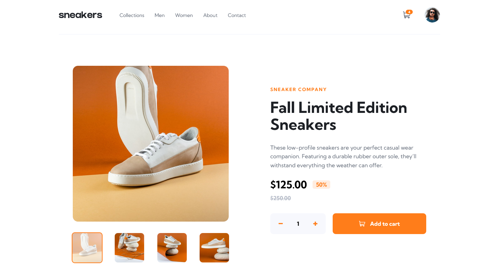

# E-commerce Product Page

## Challenge
This page should:
- Respond to the device's screen size
- Show hover states for interactive elements
- Open a lightbox gallery by clicking on the large product image
- Switch the large product image by clicking on the small thumbnail images
- Add items to the cart
- View the cart and remove items from it

### Links

- [Solution]()
- [Live Site](https://tourmaline-muffin-c2d27b.netlify.app)

### Built with

- Semantic HTML5 markup
- CSS custom properties
- ES6 JavaScript
- Desktop-first workflow

### Continued Development

While I don't think I'll come back to this particular project, I know that parts of it would definitely be easier using a framework like React. I did however want to reinforce my vanilla js, and I think that this was good practice for that. When I do similar challenges I will use frameworks as they will allow me to easily do things that I couldn't do here.

## Author

- Frontend Mentor [@Isaiah-B](https://www.frontendmentor.io/profile/Isaiah-B)
